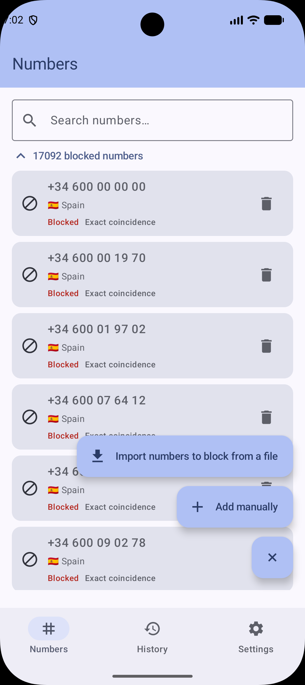
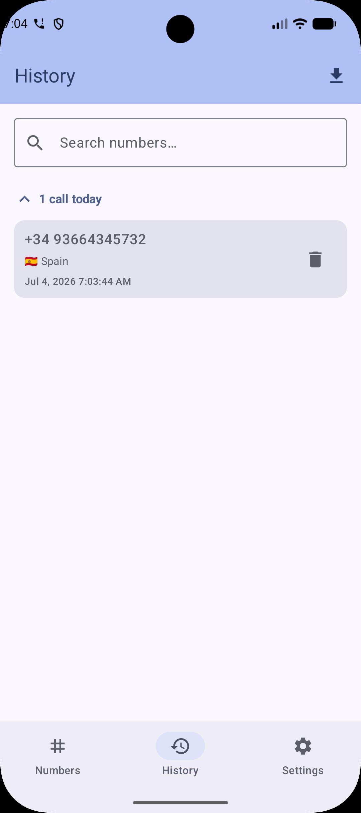
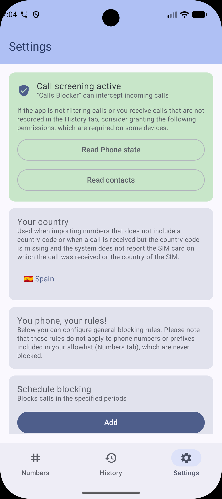
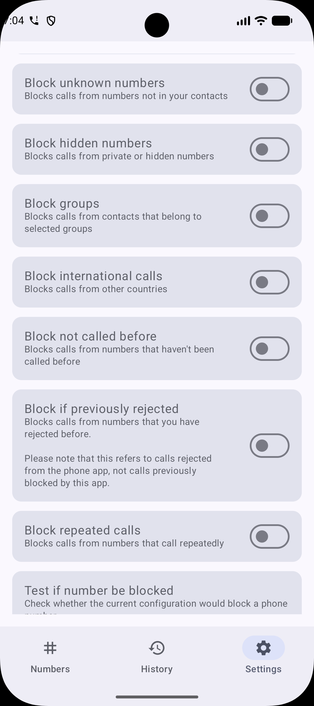
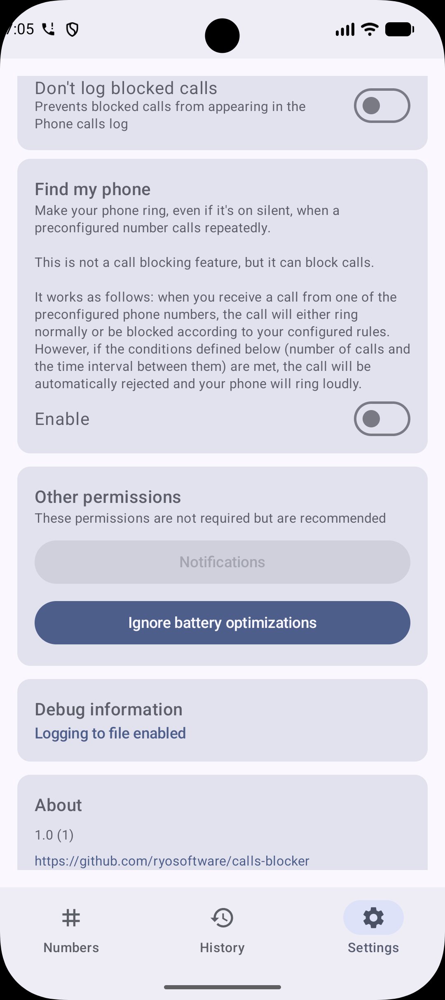
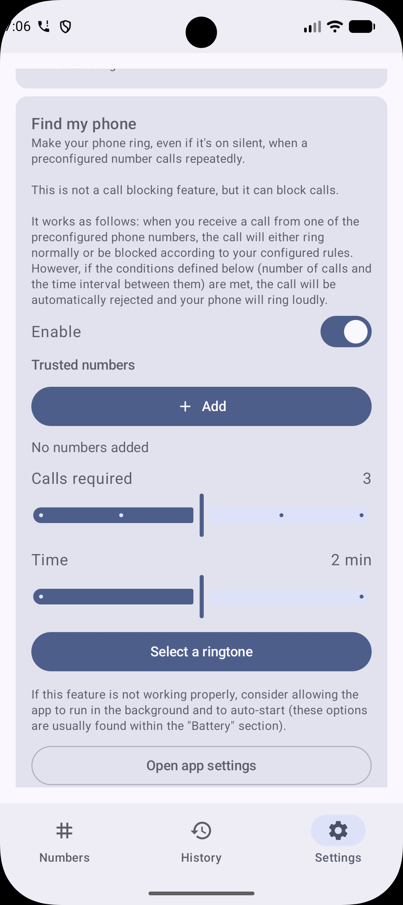

<p align="center">
  
</p>

<h1 align="center">📵 Calls Blocker</h1>

<p align="center">
  <strong>Your phone, your rules.</strong><br>
  A privacy-first, on-device call screening app for Android.
</p>

<p align="center">
  
  
  
  
</p>

---

## ✨ Features

- **Call Screening** — Intercepts incoming calls and blocks or allows them based on your rules, using the official `CallScreeningService` API.
- **Block & Allow Lists** — Add individual numbers or prefixes, choose between exact or prefix matching, batch delete.
- **Smart Blocking Rules**:
  - 🔇 Block unknown, hidden, or private numbers
  - 🌍 Block international calls (whitelist countries)
  - 👥 Block calls from specific contact groups
  - 📞 Block if you've never called them before
  - 🔁 Block repeated calls (configurable time window)
  - ⏰ Schedule-based blocking
- **Find My Phone** — Trusted numbers can trigger a loud ringing alarm, even on silent mode, with a full-screen "I found it!" button.
- **Blocking History** — Every screened call is logged, grouped by date, with CSV export and one-tap unblock.
- **CSV Import** — Bulk import numbers to block/allow.
- **Full Backup & Restore** — JSON export/import of all settings, lists, and history.
- **Block Suggestions** — Get a notification when an unknown number rings through, with quick action buttons.
- **Test Screening** — Preview whether any number would be blocked before it calls you.

## 🛠️ Tech Stack

| | |
|---|---|
| **Language** | Kotlin 2.1.0 |
| **UI** | Jetpack Compose + Material 3 |
| **Architecture** | MVVM + Repository pattern |
| **DI** | Dagger Hilt |
| **Database** | Room (with KSP) |
| **Background** | WorkManager |
| **Phone Numbers** | Google libphonenumber |
| **Serialization** | kotlinx-serialization |
| **Min SDK** | Android 11 (API 30) |

## 📱 Screenshots

<p align="center">
  
  
  
  
  
  
</p>

## CERTIFICATE SIGNATURE VERIFICATION

The SHA-256 digest of the certificate used to sign the app is as follows, and remains constant regardless of the version:

`ab5d51948ad88f0229624faae00c0a5ee4754ed8e17e7f00821eb73ebdfa2152`

The app signature certification can be checked by the following command:

`apksigner verify --verbose --print-certs app-release.apk | grep "Signer #1 certificate SHA-256 digest"`

## 🚀 Getting Started

1. Clone the repo:
   ```bash
   git clone https://github.com/ryosoftware/calls-blocker.git
   ```
2. Open the project in Android Studio.
3. Sync Gradle and run on a device/emulator running Android 11+.
4. Grant the **CALL_SCREENING** role when prompted.

## 📄 License

This project is licensed under the **Creative Commons Attribution-NonCommercial-ShareAlike 4.0 International License** — see the [LICENSE.md](LICENSE.md) file for details.

---

<p align="center">
  Made with ❤️ by <a href="https://github.com/ryosoftware">Ryosoftware</a>
</p>
